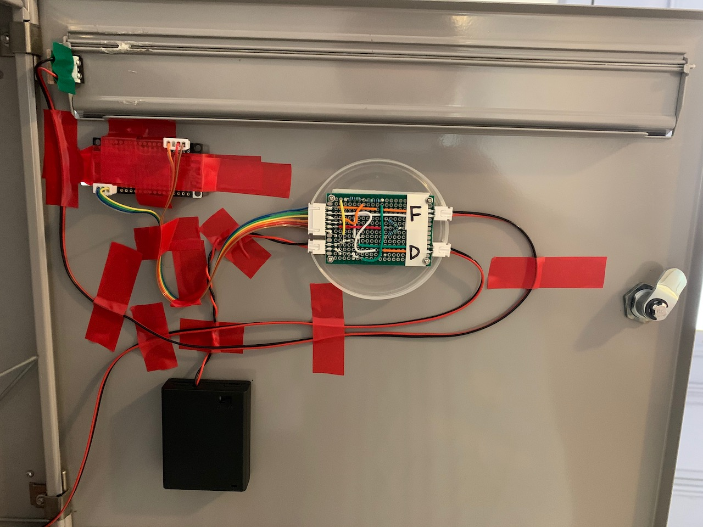
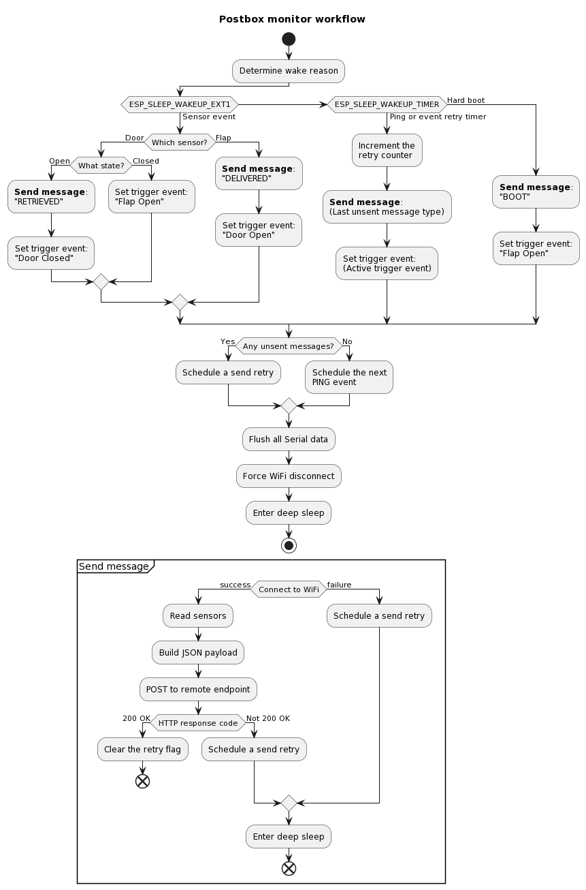

# postbox-monitor
I don't like checking my postbox every day for new deliveries, so I built a monitoring system that notifies me by email when something arrives. It works!

## The finished product
Here's how it looks, when installed:


That's a battery pack, main bus board, microcontroller board, and two switches, all stuck on the inside of my postbox door. It looks like a mess, but the important thing is to ensure nothing falling into the postbox can dislodge any cables or connectors accidentally.


## Goals for the project
 * Be **virtually invisible** from outside the postbox
 * Run on battery power for at least ~1 year without discharging
 * Break "rarely"
 * "Very low" false positive rate 
 * Be resiliant to WiFi outages or failure

## Materials required
Electronics:
* 4x AAA [battery pack](https://www.amazon.de/-/en/gp/product/B077P186ZN/ref=ppx_yo_dt_b_search_asin_title?ie=UTF8&psc=1) 
* Various cables
* Perfboard
* JST connectors
* 1x [FireBeetle ESP32 microcontroller](https://www.amazon.de/-/en/gp/product/B075CV6GR4/ref=ppx_yo_dt_b_search_asin_title?ie=UTF8&psc=1)
* 2x [Micro switches](https://www.amazon.de/gp/product/B07YDFH7H3/ref=ppx_yo_dt_b_asin_title_o02_s01?ie=UTF8&psc=1)

Other:
* Little blocks of wood
* Thin pieces of rubber
* Lots of insulating tape
* Small screws

Other systems:
* Since this device can't send email by itself, you'll need something which can host the REST endpoints that this board will connect to, when events occur. More on that later 

## Design, build & test
My postbox is a sealed metal box, one of a bank of other postboxes installed in a public hallway in my building. This severely constrains the options for remote monitoring.
* Solid metal means WiFi can't penetrate.
* No external power supply is possible.
* No interference with my neighbours postboxes is allowed.
* Nothing can be mounted on the outside, so as not to attract attention.

On the first point however there is a tiny exception - the only gap in the metal box is a slot for a plastic name tag, just a few cm wide. But it's big enough to let a signal through!

So next consideration is how to make this as low-maintenance as possible. Just do the absolute minimum, use as little power as possible, and keep operating even if external systems go offline.

<a href="images/board-close.jpeg"></a><a href="images/door-inside.jpeg"></a>

<a href="images/door-switch.jpeg"></a><a href="images/flap-switch.jpeg"></a>

### Extreme power efficiency
I chose the [FireBeetle ESP32](https://www.dfrobot.com/product-1590.html) board due to its extreme power efficiency. It supports a deep sleep mode that consumes just 10μA, with no board modifications required! Before sleeping, a number of trigger pins can be set. One can wake the board when the flap opens, and another when the door opens.

### Resilient WiFi connectivity
The WiFi network from my apartment upstairs might not always be available, due to various factors. So it's important the board can make a best effort to connect, but not waste time if the network or endpoint is unavailable at that moment.

I use a simple backoff strategy which doubles the time interval between subsequent retries, up to a maximum of 24 hours. Every 24 hours the system pings home to report it's still alive, so there is no need to exceed this limit.

### Circuit diagram
Here's a general overview:

<i>(Exported from Fritzing [file](images/postbox-monitor.fzz))</i>

### Workflow

<i>(Exported from `.puml` [file](docs/workflow.puml))</i>

## Installation
Here's how it was designed for installation with a bus board:

<i>(Exported from Fritzing [file](images/real-installation.fzz))</i>

## Event handling and monitoring
I run a Spring Boot service which hosts several controllers for capturing domestic data (e.g. my [weather station](https://github.com/skhg/weather-station)). This also includes two endpoints for capturing events from the postbox:

`POST /postbox/boot`

`POST /postbox/delivered`

`POST /postbox/retrieved`

`POST /postbox/ping`

Each call also supplies a very minimal JSON blob, for example:

```json
{
  "deviceVoltageMeasurement": 1234,
  "retryCount": 5
}
```

When my service handles a `/delivered` or `/retrieved` request, I either send a new email notifying that post has arrived, or clear the message. The details of how that's done are outside the scope of this project.  

With the additional device data I recieve in the JSON contents, I can conveniently monitor the power voltage (in mV) and the condition of the WiFi connection over time.

## Performance analysis
My service pushes all event data to InfluxDB for later analysis using Grafana. After a few hiccups at the start the system completed its commissioning on 2020-10-20. Its first set of batteries until 2022-03-02 when their voltage dropped below the required 3.3V.

With the [batteries](https://www.amazon.de/-/en/gp/product/B007B9NXAC/ref=ppx_yo_dt_b_search_asin_title?ie=UTF8&psc=1) claiming a capacity of 800mAh, this means the system is consuming [an average](https://www.omnicalculator.com/other/battery-life) of 66.93µA over ~12,000 hours (498 days).


I'm using the [Discrete](https://grafana.com/grafana/plugins/natel-discrete-panel/) panel Grafana plugin to show the postbox state over time. Green indicates "read", blue indicates "unread" and orange represents "booted".

## Ideas for improvement

Reduce the number of retries, which would further reduce power required
*  I don't really know why the retry count varies so much over time. It might be due to interference, temperature, WiFi network activity, etc.

Built-in camera
* A camera, mounted to the interior, could take a photo when new post arrives (with a brief LED flash to illuminate). This would be sent with the email alert

Slimmer mounting on the postbox door
* With a bit more finesse the wires & connectors could be made to protrude less from the microcontroller board - this would reduce the risk of a big parcel disconnecting some wires. (This happened at least once already)

Simplify the workflow
* After review it seems there are some possible problems with the code, in that events might not be detected, if a previous event has not yet been sent. This probably deserves another look.

Email send retry
* If the REST endpoint is accessible but the internet isn't, the notification email will not be sent. I need to add a retry mechanism for the fairly unlikely event that the internet is down. This has happened at least twice over the past year.